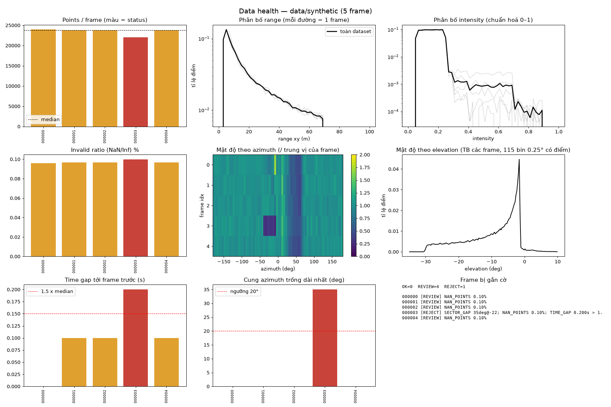
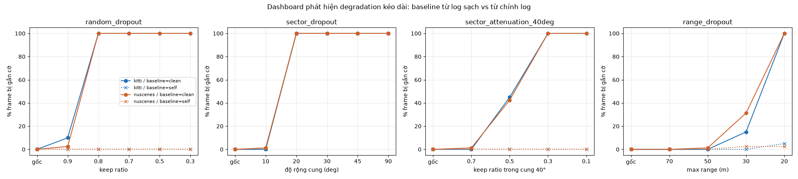
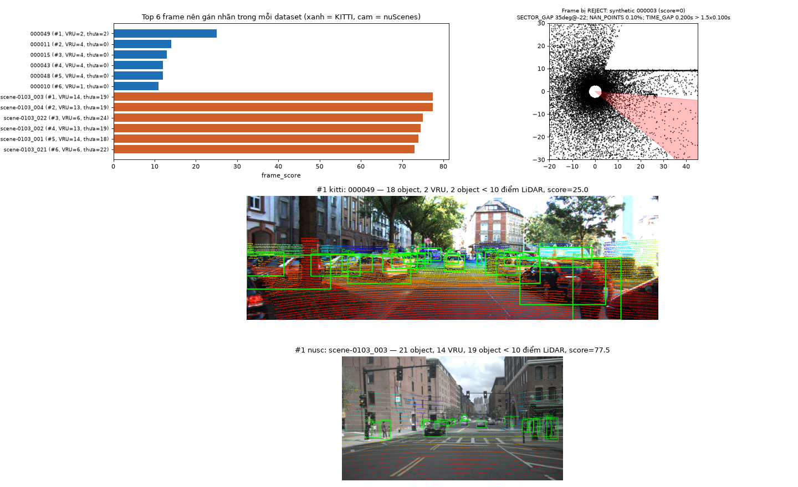
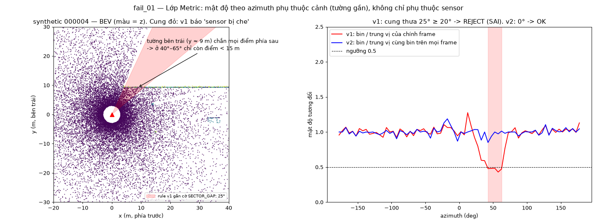
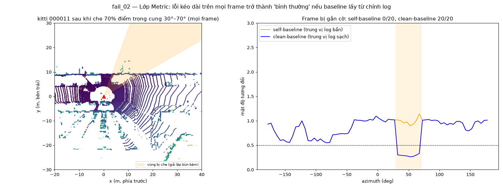

# Báo cáo Day 6: Data health dashboard cho LiDAR

- **Họ tên:** Nguyễn Nhật Thăng
- **MSSV:** 2A202602727
- **Lớp:** Track 4
- **Link repo:** https://github.com/nhat-thang/NguyenNhatThang-2A202602727-Track4-Day21
- **Topic:** E — Data health dashboard
- **Dataset:** data/synthetic, data/kitti_mini, data/nuscenes_mini_subset
- **Các frame đã dùng:** toàn bộ 105 frame: synthetic 000000–000004 (5 frame), kitti_mini 20 frame (000001 … 000061), nuScenes scene-0103_000 … scene-0103_039 (ngày) và scene-1094_000 … scene-1094_039 (đêm)

## 1. Claim

**Một bộ rule không cần model** gồm: điểm NaN; cung azimuth thưa (< 0.5 × profile tham chiếu) dài ≥ 20°; time gap > 1.5 × chu kỳ; số điểm < 85 % baseline. Bộ rule này **phát hiện 3/3 lỗi cài sẵn trong `data/synthetic`** và **báo nhầm 0/100 frame thật** (20 KITTI + 80 nuScenes). Khi lỗi kéo dài trên mọi frame, bộ rule **phát hiện 100 % frame** trong các trường hợp: mất ≥ 20 % điểm, mất một cung ≥ 20°, hoặc che ≥ 70 % điểm trong một cung 40°. Điều kiện là baseline phải lấy từ log sạch. Nếu baseline lấy từ chính log đang kiểm tra, tỉ lệ phát hiện khi mất điểm rải rác hoặc che một phần cung tụt xuống 0 %.

## 2. Evidence

**(a) Dashboard và lỗi cài sẵn trong synthetic (B6).** Kết quả nằm ở `results/health_synthetic.csv` và `results/figures/dashboard_synthetic.png`. Dashboard có 8 biểu đồ: số điểm, range, intensity, invalid ratio, heatmap azimuth, elevation, time gap và cung trống. Dashboard của 2 dataset thật: `results/figures/dashboard_kitti.png` và `dashboard_nusc.png`, mọi frame đều OK.



| Lỗi cài sẵn | Frame | Cách phát hiện (cột CSV → rule) |
|---|---|---|
| Điểm NaN (x, y, z = NaN, ~23 điểm/frame) | cả 5 frame | `invalid_ratio` = 0.10 % > 0 → `NAN_POINTS` (REVIEW). Mức 0.1 % chưa tới 1 % nên chưa REJECT |
| Cung −40°…−5° mất ~70 % điểm (che một phần) | 000003 | `max_az_gap_deg` = 35°, tâm cung −22° → `SECTOR_GAP` (REJECT). Heatmap azimuth thấy rõ ô tối |
| Rớt frame: timestamp 0.2 → 0.4 s | 000003 | `time_gap_s` = 0.200 > 1.5 × 0.100 → `TIME_GAP` |

**(b) Thí nghiệm chính: degradation sweep (CP3; bonus B1, B2, B5).** Kết quả nằm ở `results/degradation_sweep.csv` và `results/figures/degradation_sweep.png`. Mỗi cấu hình làm xấu **mọi** frame. Rule giữ nguyên, chỉ đổi baseline: `clean` lấy trung vị của log gốc, `self` lấy trung vị của chính log đã làm xấu. Seed cố định = 0, chạy lại 2 lần cho ra file CSV có md5 giống hệt. Ô số là % frame bị gắn cờ.

| Perturbation (mọi frame) | Mức | KITTI clean | KITTI self | nuSc clean | nuSc self | Rule bắn |
|---|---|---|---|---|---|---|
| Không (dữ liệu gốc) = tỉ lệ báo nhầm | – | 0 | 0 | 0 | 0 | – |
| random_dropout (keep) | 0.9 / **0.8** / 0.5 | 10 / **100** / 100 | 0 / 0 / 0 | 2 / **100** / 100 | 0 / 0 / 0 | POINT_DROP, SECTOR_GAP |
| sector_dropout (độ rộng) | 10° / **20°** / 90° | 0 / **100** / 100 | 0 / 100 / 100 | 1 / **100** / 100 | 1 / 100 / 100 | SECTOR_GAP |
| sector_attenuation 40° (keep) | 0.7 / 0.5 / **0.3** | 0 / 45 / **100** | 0 / 0 / 0 | 1 / 42 / **100** | 0 / 0 / 0 | SECTOR_GAP |
| range_dropout (max range) | 50 / 30 / **20 m** | 0 / 15 / **100** | 0 / 0 / 5 | 1 / 31 / **100** | 2 / 2 / 2 | POINT_DROP |



Nhận xét:
1. Ngưỡng phát hiện là mất 20 % điểm, cung trống 20°, hoặc range bị cắt còn 20 m. Nhẹ hơn mức đó, rule chỉ bắt được một phần frame.
2. Với self-baseline, chỉ bắt được trường hợp **mất hẳn** một cung, vì bin có 0 điểm luôn nhỏ hơn 0.5 × max(ref, 1). Mọi lỗi "mỏng dần" đều bị tham chiếu hấp thụ.
3. **(B5) KITTI và nuScenes cho đường cong gần như trùng nhau**, vì rule so tương đối với baseline của chính sensor đó, nên không phụ thuộc số beam.

**(c) KITTI 64 beam vs nuScenes 32 beam, ngày vs đêm (Advanced).** Kết quả nằm ở `results/dataset_comparison.csv` và `results/figures/compare_datasets.png`.

| Trung vị / frame | KITTI | nuSc ngày | nuSc đêm sau mưa |
|---|---|---|---|
| Return thật (r ≥ 1 m) / số dòng trong file | 120 340 / 120 340 | 26 620 / 34 720 | 26 597 / 34 720 |
| Tỉ lệ điểm sát gốc (< 1 m) | 0 % | 23 % | 23 % |
| Trung vị điểm LiDAR / object có label | 115 | 2 | 5 |
| Object < 10 điểm / frame | 0 | 15 | 6 |
| Intensity TB · độ sáng ảnh (0–255) | 0.25 · 94 | 0.06 · 107 | 0.08 · **63** |

Giải thích:
- KITTI có số return thật gấp ~4.5 lần nuScenes, do 64 so với 32 beam.
- File nuScenes giữ cả các điểm "không có return" (beam hướng lên trời) hoặc rơi lên thân xe ở r < 1 m, chiếm 21–40 %. Vì vậy `n_points` thô gần như cố định ở ~34.7k và không dùng để so sánh được.
- Label nuScenes gồm cả object xa hoặc bị che chỉ có 0–5 điểm, trong khi KITTI chỉ label object trong tầm nhìn rõ.
- Ban đêm, **camera** tối đi rõ rệt (độ sáng 107 → 63), còn các metric **LiDAR** gần như không đổi. Vì vậy, để đánh giá sức khoẻ frame ban đêm phải đo cả camera, không chỉ LiDAR.
- Hàm đếm điểm trong box đã được đối chiếu với trường `num_lidar_pts` của nuScenes và khớp ±2 điểm.

**(d) Frame score để ưu tiên gán nhãn.** Kết quả nằm ở `results/frame_ranking.csv` và `results/figures/frame_ranking.png`.

Công thức: `score = (n_objects + 2·n_VRU + 1.5·n_object<10 điểm) × {OK: 1, REVIEW: 0.5, REJECT: 0}`.

- Frame có nhiều người đi bộ/xe đạp và nhiều object thưa điểm là các ca khó nhất với detector, nên được ưu tiên.
- Frame lỗi sensor bị đưa về 0, vì gán nhãn trên dữ liệu hỏng là lãng phí.
- Ba frame đứng đầu: KITTI `000049`, `000011`, `000015`; nuScenes `scene-0103_003`, `scene-0103_004`, `scene-0103_022`.
- Frame synthetic `000003` bị REJECT nên có score = 0.
- Score được xếp hạng **trong từng dataset**, vì mật độ label của hai dataset khác nhau.



**(e) Latency (B3).** Kết quả nằm ở `results/latency.csv`. Đo trên CPU AMD (Family 25 Model 80), Windows 11, Python 3.14. Bỏ lần chạy đầu, lặp 50 lần × 5 frame (`python -m src.latency --repeats 50`).

| Dataset | Điểm/frame | p50 | p95 |
|---|---|---|---|
| KITTI | ~122k | 87 ms | 132 ms |
| nuScenes | ~35k | 40 ms | 69 ms |

Con số đã gồm projection và đếm điểm trong box, chưa gồm thời gian đọc đĩa. Laptop dao động khá mạnh giữa các lần đo: p50 của KITTI ở 4 lần chạy nằm trong khoảng 65–111 ms, do chế độ nguồn và nhiệt độ máy. Vì vậy chỉ nên đọc các con số này như bậc độ lớn.

## 3. Failure case



**fail_01: báo nhầm "sensor bị che" (lớp Metric).**
- **Khi nào sai:** rule v1 so mỗi bin azimuth 5° với trung vị các bin của *chính frame* đó. Ở synthetic `000004`, rule v1 thấy cung +40°…+65° chỉ còn 0.43–0.49 lần trung vị, kéo dài 25° (vượt ngưỡng 20°), nên gắn REJECT.
- **Vì sao sai:** sensor không hỏng. Bức tường bên trái (y ≈ 9 m) chắn mọi tia, nên cung này chỉ còn điểm ở gần hơn 15 m. Khi xe tiến lên, cung bị tường chắn rộng dần (15° ở `000000`, 25° ở `000004`). Nguyên nhân gốc: mật độ theo azimuth phụ thuộc **cảnh** chứ không chỉ phụ thuộc sensor, nên so với chính frame thì không phân biệt được hai trường hợp.
- **Cách sửa (rule v2):** so mỗi bin với trung vị của *cùng bin đó* trên nhiều frame. Bóng che cố định khi đó cũng thấp trong profile tham chiếu. Kết quả: v2 không còn gắn `SECTOR_GAP` cho `000004` (cung thưa 0°), mà vẫn bắt được cung 35° bị che ở `000003`.



**fail_02: không phát hiện lỗi kéo dài (lớp Metric).**
- **Khi nào sai:** cho rule v2 lấy profile tham chiếu từ *chính log đang kiểm tra* (self-baseline), rồi che 70 % điểm trong cung 30°–70° ở **mọi** frame KITTI (giả lập bùn bám suốt cả chuyến).
- **Kết quả:** tham chiếu bị che theo, nên **0/20** frame bị gắn cờ. Dùng baseline lấy từ log sạch của cùng sensor thì **20/20** frame bị gắn cờ. Sweep ở mục 2b cho thấy cùng hiện tượng với random dropout và range dropout (self-baseline phát hiện 0–5 %).
- **Cách phát hiện khi chạy thật:** lưu một baseline profile cho mỗi xe/sensor ngay sau khi calibration, so mọi log với baseline đó, và cảnh báo khi baseline cũ hơn N ngày.

**Hạn chế khác đã thấy:**
- Khi random dropout ≥ 50 %, lý do được ghi là `SECTOR_GAP` thay vì `POINT_DROP`, vì mọi bin đều thưa. Frame vẫn bị gắn cờ đúng nhưng chẩn đoán sai, nên cần ưu tiên rule toàn cục trước rule theo cung.
- Với sensor không quay đủ 360° (ví dụ solid-state 120°), bin luôn trống sẽ bị tính là gap, nên phải mask theo FOV thật của sensor.

## 4. Khuyến nghị nếu triển khai thật

**Use-case:** chạy làm cổng kiểm tra dữ liệu (data gate) trên đội xe ADAS hoặc robotaxi, ở hai nơi:
1. **Trên xe:** tính health theo từng frame, khoảng 87 ms/frame (p50) cho 64 beam trên 1 nhân CPU laptop, sát giới hạn 100 ms của 10 Hz. Muốn chạy được trên xe cần tách thành thread riêng, chỉ tính mỗi frame thứ 2–3 hoặc bỏ các metric camera/box, vì cảnh báo sensor không cần tần số 10 Hz. Nếu cung trống ≥ 20° kéo dài quá 1 s, hệ thống phát cảnh báo "rửa/kiểm tra sensor" và hạ mức tin cậy của perception ở phía bị che.
2. **Offline khi ingest log:** frame REJECT không đưa đi gán nhãn, frame REVIEW được kiểm tra nhanh, còn frame OK xếp theo `frame_score` để gán nhãn trước.

**Trade-off:**
- Ngưỡng chặt (gap 10°, point drop 90 %) bắt được nhiều lỗi nhẹ hơn nhưng báo nhầm nhiều hơn, ví dụ khi đỗ cạnh tường hay xe tải (xem fail_01).
- Rule v2 cần **baseline sạch theo từng xe/sensor**, tức thêm một bước vận hành sau mỗi lần calibration.
- Bộ rule không cần model nên rẻ và giải thích được, nhưng không biết frame đó có làm model fail hay không. Bước tiếp theo là đối chiếu `status` với score/recall của detector (nối với topic B/C).

**Chỉ số nên ghi log trên xe:**
- `invalid_ratio`, `max_az_gap_deg` và tâm cung, `n_returns`, `near_ratio`, `range_p95`
- `time_gap_s`, độ lệch LiDAR–camera (ms), độ sáng ảnh
- phiên bản baseline đang dùng
- nhiệt độ và tốc độ xe, để tìm tương quan khi lỗi xuất hiện

## 5. Cách chạy lại

Chạy từ gốc repo, sau khi `pip install -r requirements.txt` (chỉ cần CPU). Mọi script trong `src/` đều có `--help` (B4).

```bash
python -m starter.projection --data-root data/synthetic --frame 000000   # test CP2: (u,v) ≈ (614,175)
python -m src.dashboard --data-root data/synthetic --name synthetic      # -> results/health_synthetic.csv + figures/dashboard_synthetic.png
python -m src.dashboard --data-root data/kitti_mini --name kitti
python -m src.dashboard --data-root data/nuscenes_mini_subset --name nusc
python -m src.compare_datasets        # so sánh KITTI/nuScenes ngày/đêm + frame ranking (cần 3 lệnh trên chạy trước)
python -m src.degradation_sweep       # sweep 4 kiểu x 5-6 mức x 2 dataset x 2 baseline, khoảng 2 phút
python -m src.failure_cases           # fail_01, fail_02
python -m src.latency --repeats 50    # p50/p95, số liệu phụ thuộc máy
```

Dùng lại cho log mới: `python -m src.dashboard --data-root <thư mục KITTI hoặc nuScenes> --name <tên>`. Ngưỡng của các rule nằm ở đầu file `src/health.py` (các hằng `TH_*`).

## 6. Khai báo sử dụng AI

| Công cụ | Dùng cho việc gì | Bạn đã kiểm chứng thế nào |
|---|---|---|
| Claude Code (Claude Opus 5.5) | Khảo sát dữ liệu để tìm lỗi cài sẵn; viết 2 hàm TODO trong `projection.py`; viết code `src/` (metric, rule, dashboard, sweep, vẽ biểu đồ); soạn nháp REPORT | Test tay điểm (10, 0, 0) cho z_cam = 9.73 và (u, v) = (614, 175); điểm NaN bị loại; nhìn ảnh overlay KITTI và nuScenes thấy điểm khớp lên xe/người. Đối chiếu `points_in_box` với `num_lidar_pts` của nuScenes (khớp ±2). Kiểm từng lỗi synthetic bằng số liệu thô: `timestamps.txt`, histogram azimuth 1°. Chạy sweep 2 lần cho md5 giống nhau. Tự đọc và giải thích được từng rule và ngưỡng. |
